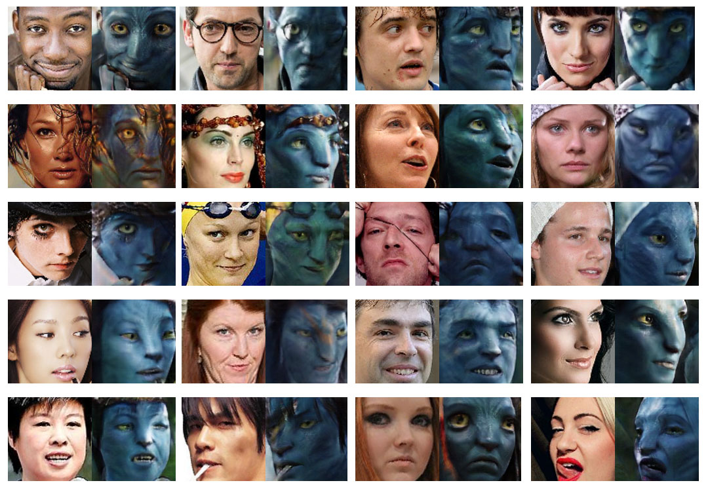
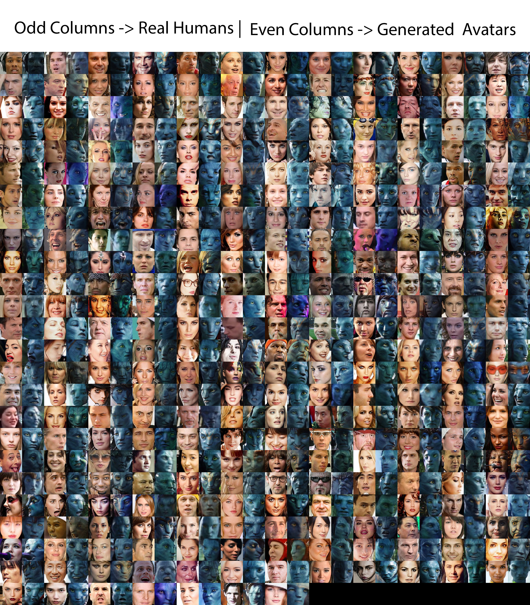
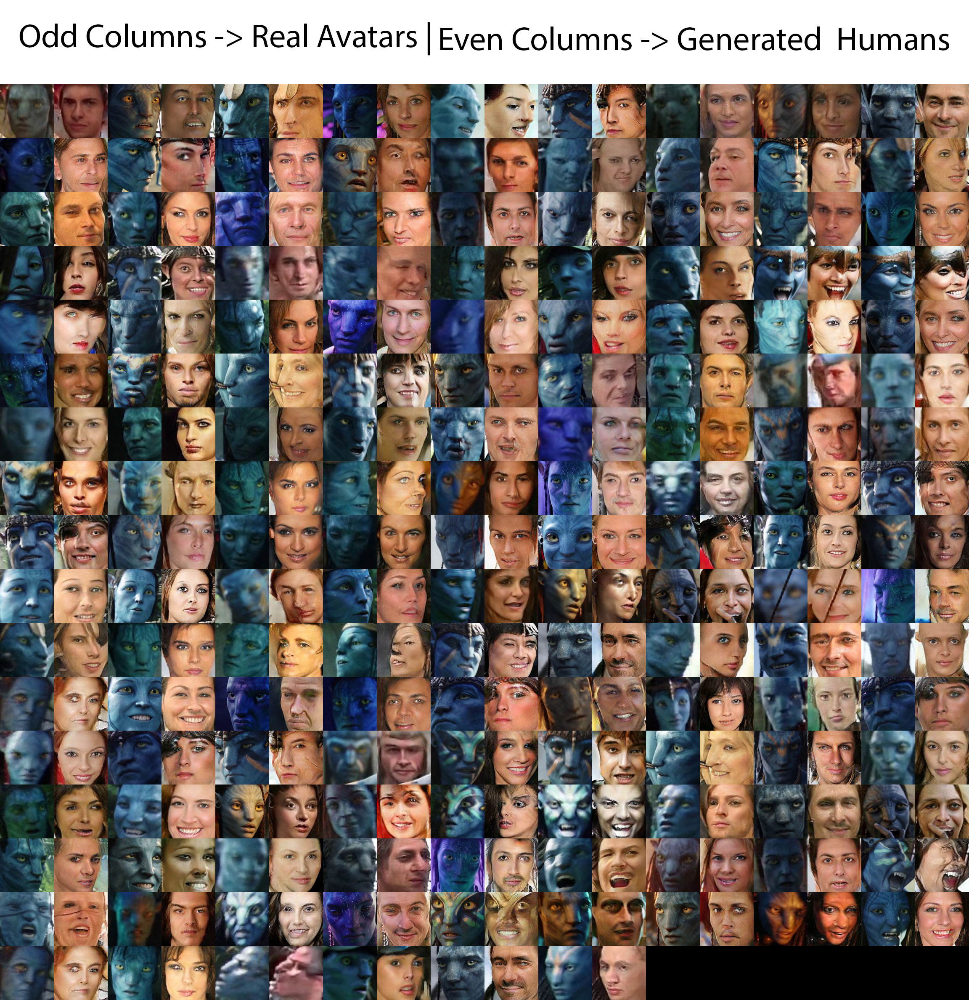

# AIGN for Image Translation 
Open source Implementation of Adversarial Inverse Graphics Network Biased SuperResolution for Image Translation

  
 
## Introduction

The following is an Unofficial implementation of [Adversarial Inverse Graphics Network ](https://arxiv.org/abs/1705.11166) by Hsiao-Yu Fish Tung, Adam W. Harley, William Seto, Katerina Fragkiadaki. 

The folllowing topics are covered :
- [x] **Data-Preprocessing**. Images are transformed in the range of -1 to 1
- [x] **Generative Model**. Resnet Deconv model as mentioned in the paper
- [x] **Discriminative Model**. Conv discrim model mentioned in the paper
- [x] **Renderer Model**. Average Pooling Renderer for Image Translation

## Renderer

Change the Render Function dependent on your Need. The renderer is the one which adds bias to the network. I have currently kept it according to biased SuperResolution as mentioned in Paper but dependent on the data you have to change it. For Avatar to Human I converted the rendered Image to GrayScale

## Dataset
**The dataset has been collected by me by applying a face cropper on all Avatar Movie frames 
The human dataset is taken from Celeb Data**
*trainA represents *FROM* part of Translation and trainB represents *TO* part*
```bash
unzip ppl2avatar.zip
cp -r ppl2avatar datasets/
``` 


## Prerequisite
The main requirements can be installed by:
```bash
pip install -r requirements.txt

``` 


## Training
 **Train Biased SuperResolution AIGN Model**
 *Change the value of lambda dependent on the bias* 
 ```bash
python main.py --dataset_dir ppl2avatar --lr 0.0001 --continue_train True

``` 

## Testing
 *Testing on testA data* 
 
 ```bash
python main.py --dataset_dir ppl2avatar/ --phase test

``` 
## Results

  
 
   


