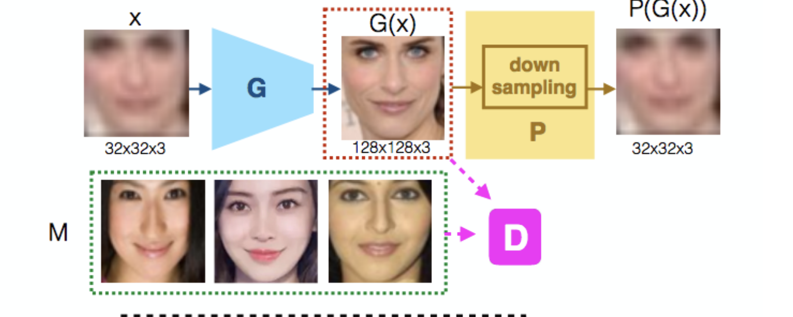
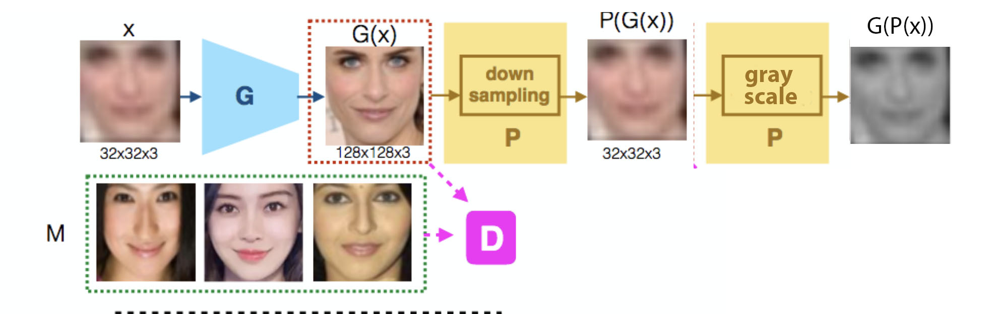
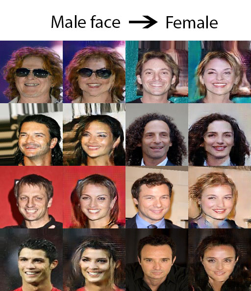
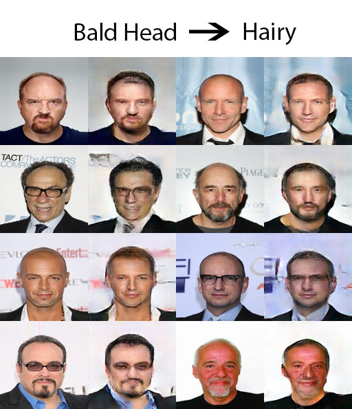
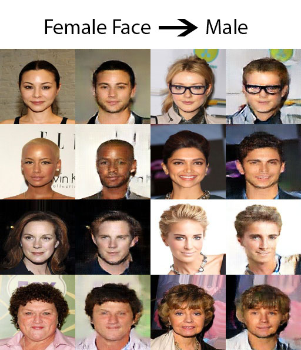
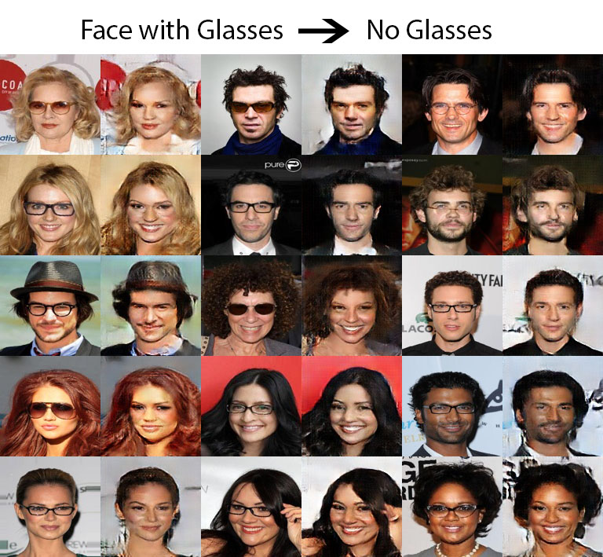
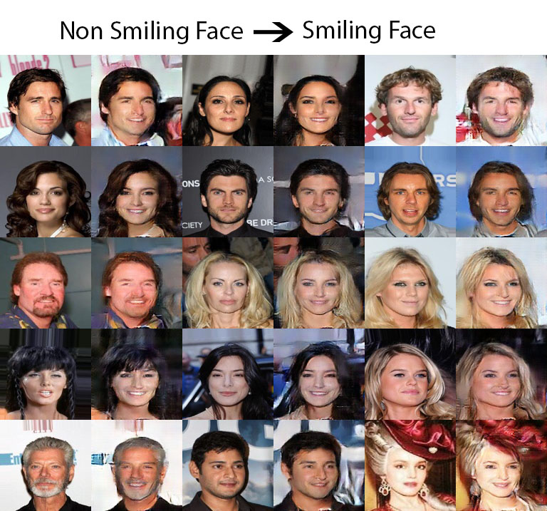
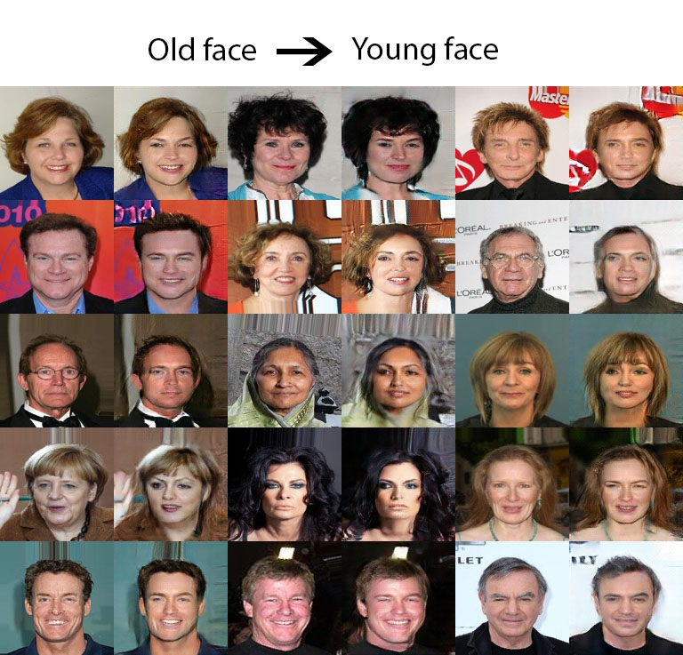
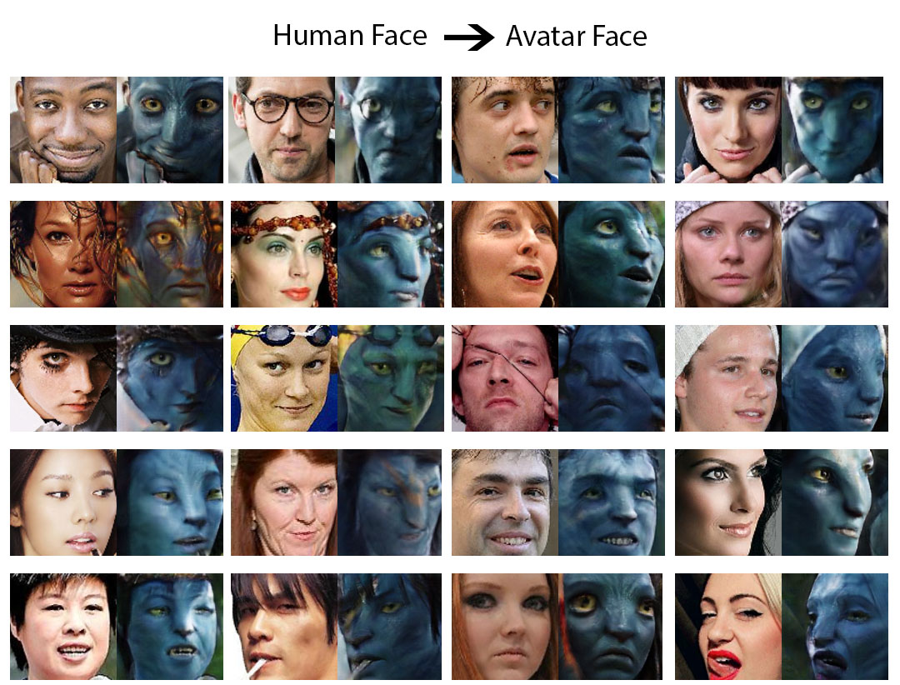

## Abstract

Researchers have developed excellent feed-forward
models that learn to map images to desired outputs, such as
to the images’ latent factors, or to other images, using supervised
learning. Learning such mappings from unlabelled
data, or improving upon supervised models by exploiting
unlabelled data, remains elusive. We argue that there are
two important parts to learning without annotations: (i)
matching the predictions to the input observations, and (ii)
matching the predictions to known priors. We propose Adversarial
Inverse Graphics networks (AIGNs): weakly supervised
neural network models that combine feedback from
rendering their predictions, with distribution matching between
their predictions and a collection of ground-truth
factors. We apply AIGNs to 3D human pose estimation
and 3D structure and egomotion estimation, and outperform
models supervised by only paired annotations. We
further apply AIGNs to facial image transformation using
super-resolution and inpainting renderers, while deliberately
adding biases in the ground-truth datasets. Our model
seamlessly incorporates such biases, rendering input faces
towards young, old, feminine, masculine or Tom Cruiselike
equivalents (depending on the chosen bias), or adding
lip and nose augmentations while inpainting concealed lips
and noses.

## Renderer

The most important part of an AIGN network is its Renderer. The renderer in this paper is a non parameteric decoder which needs to be hand engineered dependent on the use-case.
As mentioned in the paper the renderer used by the authors for face translation is a 4:1 Average Pooling Network.

For few specific cases I have extended the renderer to a Gray Scale Average Pooling Network, which results in good results for  Human to Avatar and Black Hair to Blonde Hair as in the previous renderer a color change affects the network negatively

## Learning Transistion

Human to Avatar

## Results

    
    

    
    

    
    
    

